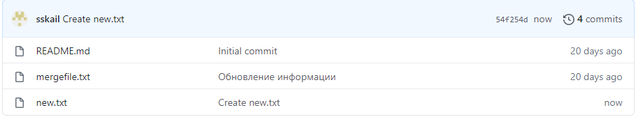
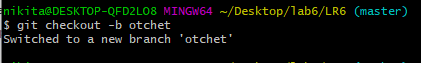

# ОТЧЁТ О ЛАБОРАТОРНОЙ РАБОТЕ №6 
# ПО ОСНОВАМ ПРОГРАММИРОВАНИЯ
# Выполнил студент группы 4916 Бирюков Никита

### Ход работы:
На сайте GitHub сделал копию https://github.com/Kurtyanik/LR6/

Создал на срабочем столе папку lab6, зашел в нее и, щелкнув правой кнопкой мыши, выбрал git bash here

Настроил клиен git

Командой _git clone клонировал удаленный репозиторий на компьютер 

Затем через графический интерфейс GitHub добавил новый файл _new.txt_ в удалённый репозиторий в ветку __master__

Пользуясь командой _git pull _ загрузил изменения из удалённого репозитория в локальный

Командой _git log_ получил список операций/коммитов в ветках master и branch1 

Используя _git log -p_ получил более подробную информацию по последнем изменениям в ветках

Попытался выполнить слияние веток **master** и **branch1** командой _git merge branch1_ и получил ошибку

Вручную изменил файл mergefile.txt, вызвавший ошибку слияния и выполнил коммит

После я удалил ветку **branch1** командой _git branch -d_

Запушил всё в удалённый репозиторий командой _git push_

Затем сделал несколько изменений, сначала добавил файл, затем изменил его, а после добавил новый файл.

Коммандой _git log -3_ вывел последние 3 лога.

Командой _git reset --hard HEAD~1_ выполнил откат последнего коммита - добавления файла **Новый текстовый документ.txt**

Коммандой _git log -3_ вывел последние 3 лога.

Запушил изменённую ветку

Пользуясь командой _git checkout -b otchet_ создал новую ветку **otchet**

Текущая история _git log --graph_ . Аргумент --graph позволяет графически изобразить ветки и коммиты на них

С помощью команды _git add ._ подготовил все скриншоты в папке **screenshots** к пушу

Запушил файлы скриншотов в удалённый репозиторий

Оформляю отчёт в файле **README.md** используя Notepad++

Лог команд из папки **.git/logs**

Получил историю операций в форматированном виде

Все файлы скриншотов лежат в папке **screenshots**